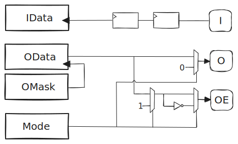

- Start Date: (fill me in with today's date, YYYY-MM-DD)
- RFC PR: [amaranth-lang/rfcs#0000](https://github.com/amaranth-lang/rfcs/pull/0000)
- Amaranth Issue: [amaranth-lang/amaranth#0000](https://github.com/amaranth-lang/amaranth/issues/0000)

# GPIO peripheral RFC

## Summary
[summary]: #summary

Add a SoC peripheral to control GPIO pins.

## Motivation
[motivation]: #motivation

[GPIOs](https://en.wikipedia.org/wiki/General-purpose_input/output) are useful for a wide range of scenarios, such as driving external circuitry or acting as fallback for unimplemented/misbehaving peripherals in early iterations of a design.

Amaranth SoC seems like an appropriate place for a GPIO peripheral, which depends on features that are already provided by the library. Due to its relative simplicity, it is also a good candidate for using the recent CSR register API in realistic conditions.

## Guide-level explanation
[guide-level-explanation]: #guide-level-explanation

### Usage

```python3
from amaranth import *
from amaranth.lib import wiring
from amaranth.lib.wiring import connect

from amaranth_soc import csr
from amaranth_soc import gpio


class MySoC(wiring.Component):
    def elaborate(self, platform):
        m = Module()

        # ...

        # Use a GPIO peripheral to control four LEDs:

        m.submodules.gpio = gpio = gpio.Peripheral(pin_count=4, addr_width=8, data_width=8)

        for n in range(4):
            led = platform.request("led", n)
            m.d.comb += [
                led.oe.eq(gpio.pins[n].oe),
                led.o .eq(gpio.pins[n].o),
            ]

        # Add the peripheral to a CSR bus decoder:

        m.submodules.csr_decoder = csr_decoder = csr.Decoder(addr_width=31, data_width=8)

        csr_decoder.add(gpio.bus, addr=0x1000)

        # ...

        return m
```

### Overview

The following figure is a simplified diagram of the peripheral. CSR registers are on the left-hand side, a single pin is on the right side:



### Registers

#### Mode (read/write)


Each `Mode.m_x` field can hold the following values:

```python3
class Mode(enum.IntEnum, shape=unsigned(2)):
    INPUT_ONLY = 0b00
    PUSH_PULL  = 0b10
    OPEN_DRAIN = 0b01
```

- If `Mode.m_x` is `INPUT_ONLY`, then `pins[x].oe = 0`.
- If `Mode.m_x` is `PUSH_PULL`, then `pins[x].oe = 1` and `pins[x].o = OData.od_x`.
- If `Mode.m_x` is `OPEN_DRAIN`, then `pins[x].oe = ~OData.od_x` and `pins[x].o = 0`.

#### IData (read-only)


Each `IData.id_x` field holds the last value of `pins[x].i` sampled on a clock cycle.

#### OData (read/write)


Each `OData.od_x` field holds the next value of `pins[x].o` in `PUSH_PULL` mode.

#### OMask (write-only)


- Writing `1` to an `OMask.s_x` field sets the `OData.od_x` field.
- Writing `1` to an `OMask.c_x` field clears the `OData.od_x` field.

## Reference-level explanation
[reference-level-explanation]: #reference-level-explanation

### `amaranth_soc.gpio.PinSignature`

The `gpio.PinSignature` class is a `wiring.Signature` describing the interface between the GPIO peripheral and a single pin.

The members of a `gpio.PinSignature` are defined as follows:

```python3
{
    "i":  In(unsigned(1)),
    "o":  Out(unsigned(1)),
    "oe": Out(unsigned(1)),
}
```

### `amaranth_soc.gpio.Peripheral`

The `gpio.Peripheral` class is a `wiring.Component` implementing a GPIO controller, with:
- a `.__init__(self, *, pin_count, addr_width, data_width, name=None)` constructor, where:
  * `pin_count` is a non-negative integer.
  * `addr_width`, `data_width` and `name` are passed to a `csr.Builder`
- a `.signature` property, that returns a `wiring.Signature` with the following members:

```python3
{
    "bus": In(csr.Signature(addr_width, data_width)),
    "pins": Out(gpio.PinSignature()).array(pin_count),
}
```

- a `.elaborate(self, platform)` method, that connects each pin in `self.pins` to its associated fields in the registers exposed by `self.bus`.

## Drawbacks
[drawbacks]: #drawbacks

While existing implementations (such as STM32 GPIOs) have features like pin multiplexing and configurable pull-up/down resistors, in the proposed design, those would have to be implemented in a separate component.

## Rationale and alternatives
[rationale-and-alternatives]: #rationale-and-alternatives

The proposed design moves platform-specific details outside of its scope, which:
- reduces the amount of non-portable code to maintain, while allowing implementation freedom for users needing it.
- avoids introducing dependencies on upstream APIs that are deprecated or expected to evolve soon (such as `amaranth.build`).

As an alternative:
- do not host any peripheral in amaranth-soc and always develop them downstream.
- include a pin multiplexer inside the GPIO peripheral.

## Prior art
[prior-art]: #prior-art

While they can be found in most microcontollers, the design of GPIOs in STM32 has inspired part of this RFC.

## Unresolved questions
[unresolved-questions]: #unresolved-questions

- Should we support synchronizing a pin input on falling edges of the clock ?

## Future possibilities
[future-possibilities]: #future-possibilities

- Implement a pin multiplexer peripheral, that can be composed with this one to allow reusing other pins of a SoC as GPIOs.
