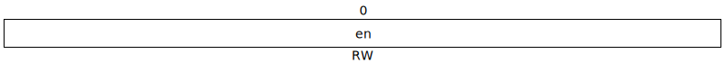
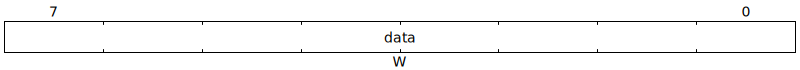

- Start Date: (fill me in with today's date, YYYY-MM-DD)
- RFC PR: [amaranth-lang/rfcs#0000](https://github.com/amaranth-lang/rfcs/pull/0000)
- Amaranth Issue: [amaranth-lang/amaranth#0000](https://github.com/amaranth-lang/amaranth/issues/0000)

# UART peripheral RFC

## Summary
[summary]: #summary

Add a SoC peripheral for UART devices.

## Motivation
[motivation]: #motivation

An UART is a generally useful peripheral for serial communication between devices.

## Guide-level explanation
[guide-level-explanation]: #guide-level-explanation

### Usage

```python3
from amaranth import *
from amaranth.lib import wiring
from amaranth.lib.wiring import connect

from amaranth_stdio.serial import AsyncSerialRX, AsyncSerialTX

from amaranth_soc import csr
from amaranth_soc import uart


class MySoC(wiring.Component):
    def elaborate(self, platform):
        m = Module()

        # ...

        # Instantiate an UART peripheral:

        uart_divisor = int(platform.default_clk_frequency / 115200)

        m.submodules.uart = uart = uart.Peripheral(divisor_init=uart_divisor, addr_width=8, data_width=8)

        # Instantiate and connect the UART PHYs:

        uart_pins = platform.request("uart", 0)

        uart_phy_rx = AsyncSerialRX(uart_divisor, divisor_bits=16, pins=uart_pins)
        uart_phy_tx = AsyncSerialTX(uart_divisor, divisor_bits=16, pins=uart_pins)

        m.submodules.uart_phy_rx = uart_phy_rx
        m.submodules.uart_phy_tx = uart_phy_tx

        m.d.comb += [
            uart_phy_rx.divisor.eq(uart.rx.divisor),

            uart.rx.stream.data.eq(uart_phy_rx.data),
            uart.rx.stream.valid.eq(uart_phy_rx.rdy),
            uart_phy_rx.ack.eq(uart.stream.ready),

            uart.rx.overflow.eq(uart_phy_rx.err.overflow),
            uart.rx.error.eq(uart_phy_rx.err.frame),
        ]

        m.d.comb += [
            uart_phy_tx.divisor.eq(uart.tx.divisor),

            uart_phy_tx.data.eq(uart.tx.stream.data),
            uart_phy_tx.ack.eq(uart.tx.stream.valid),
            uart.tx.stream.ready.eq(uart_phy_tx.rdy),
        ]

        # Add the UART peripheral to a CSR bus decoder:

        m.submodules.csr_decoder = csr_decoder = csr.Decoder(addr_width=31, data_width=8)

        csr_decoder.add(uart.bus, addr=0x1000)

        # ...

        return m

```

### Registers

#### Receiver

##### Enable (read/write)



- If `Enable.en` is 0, the receiver is held in reset state.

- `Enable.en` is initialized to 0.

##### Divisor (read/write)


- If `Enable.en` is 0, `Divisor` is read-only.

- `Divisor.cnt` is initialized to `divisor_cnt_init`.
- `Divisor.psc` is initialized to `divisor_psc_init`.

Assuming a clock frequency of 100MHz, the receiver baudrate is computed like so:

```python3
baudrate = ((1 << psc) * 100e6) // (cnt + 1)
```

##### Status (read/write)


- `Status.rdy` indicates that the receive buffer contains at least one character.
- `Status.ovf` is set if a new frame was received while the receive buffer is full.
- `Status.err` is set if any implementation-specific error condition occured.

- `Status.ovf` and `Status.err` are initialized to 0.

##### Data (read-only)


- If `Status.rdy` is 1, reading from `Data` consumes one character from the receive buffer.

#### Transmitter

##### Enable (read/write)


- If `Enable.en` is 0, the transmitter is held in reset state.

- `Enable.en` is initialized to 0.

##### Divisor (read/write)


- If `Enable.en` is 0, `Divisor` is read-only.

- `Divisor.cnt` is initialized to `divisor_cnt_init`.
- `Divisor.psc` is initialized to `divisor_psc_init`.

Assuming a clock frequency of 100MHz, the transmitter baudrate is computed like so:

```python3
baudrate = ((2 ** psc) * 100e6) // (cnt + 1)
```

##### Status (read-only)


- `Status.rdy` indicates that the transmit buffer has available space for at least one character.

##### Data (write-only)



- If `Status.rdy` is 1, writing to `Data` adds one character to the transmit buffer.

## Reference-level explanation
[reference-level-explanation]: #reference-level-explanation

### `amaranth_soc.uart.ReceiverPHYSignature`

The `uart.ReceiverPHYSignature` class is a `wiring.Signature` describing the interface between the UART peripheral and its receiver PHY, with:
- a `.__init__(self, *, data_bits)` constructor, where `data_bits` is a non-negative integer.

Its members are defined as follows:

```python3
{
    "divisor":  In(unsigned(20)),
    "stream":   Out(wiring.Signature({
                    "data":  Out(unsigned(data_bits)),
                    "valid": Out(unsigned(1)),
                    "ready": In(unsigned(1)),
                })),
    "overflow": Out(unsigned(1)),
    "error":    Out(unsigned(1)),
}
```

### `amaranth_soc.uart.TransmitterPHYSignature`

The `uart.TransmitterSignature` class is a `wiring.Signature` describing the interface between the UART peripheral and its transmitter PHY, with:
- a `.__init__(self, *, data_bits)` constructor, where `data_bits` is a non-negative integer.

Its members are defined as follows:

```python3
{
    "divisor": In(unsigned(20)),
    "stream":  In(wiring.Signature({
                   "data":  Out(unsigned(data_bits)),
                   "valid": Out(unsigned(1)),
                   "ready": In(unsigned(1)),
               })),
}
```

### `amaranth_soc.uart.ReceiverPeripheral`

The `uart.ReceiverPeripheral` class is a `wiring.Component` implementing the receiver of an UART peripheral, with:
- a `.__init__(self, *, divisor_init, addr_width, data_width=8, name=None, data_bits=8)` constructor, where:
  * `divisor_init` is a positive integer used as initial value for `Divisor`. It is a 16-bit value, where the lower 13 bits are assigned to `Divisor.cnt`, and the upper 3 bits are assigned to `Divisor.psc` as a log2.
  * `addr_width`, `data_width` and `name` are passed to a `csr.Builder`.
  * `data_bits` is a non-negative integer passed to `Data` and `ReceiverPHYSignature`.
- a `.signature` property, that returns a `wiring.Signature` with the following members:

```python3
{
    "bus": In(csr.Signature(addr_width, data_width)),
    "phy": In(ReceiverPHYSignature(data_bits)),
}
```

### `amaranth_soc.uart.TransmitterPeripheral`

The `uart.TransmitterPeripheral` class is a `wiring.Component` implementing the transmitter of an UART peripheral, with:
- a `.__init__(self, *, divisor_init, addr_width, data_width=8, name=None, data_bits=8)` constructor, where:
  * `divisor_init` is a positive integer used as initial value for `Divisor`. It is a 16-bit value, where the lower 13 bits are assigned to `Divisor.cnt`, and the upper 3 bits are assigned to `Divisor.psc` as a log2.
  * `addr_width`, `data_width` and `name` are passed to a `csr.Builder`.
  * `data_bits` is a non-negative integer passed to `Data` and `TransmitterPHYSignature`.
- a `.signature` property, that returns a `wiring.Signature` with the following members:

```python3
{
    "bus": In(csr.Signature(addr_width, data_width)),
    "phy": In(TransmitterPHYSignature(data_bits)),
}
```

### `amaranth_soc.uart.Peripheral`

The `uart.Peripheral` class is a `wiring.Component` implementing an UART peripheral, with:
- a `.__init__(self, *, divisor_init, addr_width, data_width=8, name=None, data_bits=8)` constructor, where:
  * `divisor_init` is a positive integer used as initial value for `Divisor`. It is a 16-bit value, where the lower 13 bits are assigned to `Divisor.cnt`, and the upper 3 bits are assigned to `Divisor.psc` as a log2.
  * `addr_width`, `data_width` and `name` are passed to a `csr.Builder`. `addr_width` must be at least 1. The peripheral address space is split in two, with the lower half occupied by a `ReceiverPeripheral` and the upper by a `TransmitterPeripheral`.
  * `data_bits` is a non-negative integer passed to `ReceiverPeripheral`, `TransmitterPeripheral`, `ReceiverPHYSignature` and `TransmitterPHYSignature`.

- a `.signature` property, that returns a `wiring.Signature` with the following members:

```python3
{
    "bus": In(csr.Signature(addr_width, data_width)),
    "rx":  In(ReceiverPHYSignature(data_bits)),
    "tx":  In(TransmitterPHYSignature(data_bits)),
}
```

## Drawbacks
[drawbacks]: #drawbacks

- This design decouples the UART peripheral from its PHY, which must be provided by the user.
- The receiver and transmitter have separate `Divider` registers, despite using identical values
  in most cases.
- Configuring the baudrate through the `Divider` register requires knowledge of the clock frequency used by the peripheral.

## Rationale and alternatives
[rationale-and-alternatives]: #rationale-and-alternatives

- This design is intended to be minimal and work reliably for the most common use-cases (i.e. 8-N-1).
- Decoupling the peripheral from the PHY allows flexibility in implementations. For example, it is easy to add FIFOs between the PHYs and the peripheral.
- A standalone `ReceiverPeripheral` or `TransmitterPeripheral` can be instantiated.

- The choice of a 16-bit `Divisor` register with a 3-bit prescaler covers the most common frequency/baudrate combinations with an error rate (due to quantization) below 1%.

*TODO: a table showing frequency/baudrate combinations*

- As an alternative:
  * implement the PHY in the peripheral itself, and expose pin interfaces in a similar manner as the GPIO peripheral of RFC 49.

## Prior art
[prior-art]: #prior-art

UART peripherals are commonly found in microcontrollers.

## Unresolved questions
[unresolved-questions]: #unresolved-questions

None.

## Future possibilities
[future-possibilities]: #future-possibilities

- Add a separate 16550-compatible UART peripheral.
- Expand this peripheral with additional features, such as:
  * parity
  * auto baudrate
  * oversampling
  * hardware flow control
  * interrupts
  * DMA
