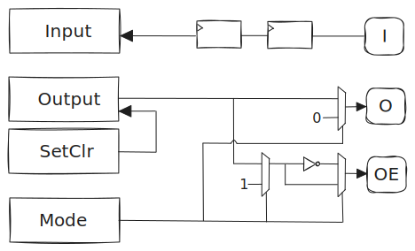
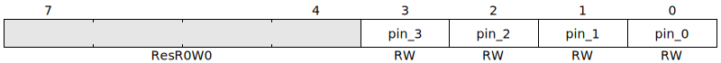
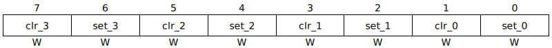

- Start Date: 2024-03-08
- RFC PR: [amaranth-lang/rfcs#49](https://github.com/amaranth-lang/rfcs/pull/49)
- Amaranth Issue: [amaranth-lang/amaranth-soc#77](https://github.com/amaranth-lang/amaranth-soc/issues/77)

# GPIO peripheral RFC

## Summary
[summary]: #summary

Add a SoC peripheral to control GPIO pins.

## Motivation
[motivation]: #motivation

[GPIOs](https://en.wikipedia.org/wiki/General-purpose_input/output) are useful for a wide range of scenarios, such as driving external circuitry or acting as fallback for unimplemented/misbehaving peripherals in early iterations of a design.

Amaranth SoC seems like an appropriate place for a GPIO peripheral, which depends on features that are already provided by the library. Due to its relative simplicity, it is also a good candidate for using the recent CSR register API in realistic conditions.

## Guide-level explanation
[guide-level-explanation]: #guide-level-explanation

### Usage

```python3
from amaranth import *
from amaranth.lib import wiring
from amaranth.lib.wiring import connect

from amaranth_soc import csr
from amaranth_soc import gpio


class MySoC(wiring.Component):
    def elaborate(self, platform):
        m = Module()

        # ...

        # Use a GPIO peripheral to control four LEDs:

        m.submodules.led_gpio = led_gpio = gpio.Peripheral(pin_count=4, addr_width=8, data_width=8)

        for n in range(4):
            connect(m, led_gpio.pins[n], platform.request("led", n, dir="io"))

        # Add the peripheral to a CSR bus decoder:

        m.submodules.csr_decoder = csr_decoder = csr.Decoder(addr_width=31, data_width=8)

        csr_decoder.add(led_gpio.bus, addr=0x1000)

        # ...

        return m
```

### Overview

The following figure is a simplified diagram of the peripheral. CSR registers are on the left-hand side, a single pin is on the right side:



### Registers

#### Mode (read/write)


Each `Mode.pin_x` field can hold the following values:

```python3
class Mode(enum.Enum, shape=unsigned(2)):
    INPUT_ONLY = 0b00
    PUSH_PULL  = 0b01
    OPEN_DRAIN = 0b10
    ALTERNATE  = 0b11
```

Each `Mode.pin_x` field resets to `INPUT_ONLY`.

If `Mode.pin_x` is `INPUT_ONLY`:
- `pins[x].oe` is 0.
- `pins[x].o` is connected to `Output.pin_x`.
- `Input.pin_x` is connected to `pins[x].i`.
- `alt_mode[x]` is 0.

If `Mode.pin_x` is `PUSH_PULL`:
- `pins[x].oe` is 1.
- `pins[x].o` is conencted to `Output.pin_x`.
- `Input.pin_x` is connected to `pins[x].i`.
- `alt_mode[x]` is 0.

If `Mode.pin_x` is `OPEN_DRAIN`:
- `pins[x].oe` is connected to `~Output.pin_x`.
- `pins[x].o` is 0.
- `Input.pin_x` is connected to `pins[x].i`.
- `alt_mode[x]` is 0.

If `Mode.pin_x` is `ALTERNATE`:
- `pins[x].oe` is 0.
- `pins[x].o` is connected to `Output.pin_x`.
- `Input.pin_x` is connected to `pins[x].i`.
- `alt_mode[x]` is 1.

When `alt_mode[x]` is 1, a component connected to the GPIO peripheral (such as a pin multiplexer) may assign implementation-specific functions to `Input.pin_x` and `Output.pin_x`.

#### Input (read-only)


The number of synchronization stages between `pins[x].i` and `Input.pin_x` is defined by the `input_stages` parameter, which defaults to 2. Synchronization is done on rising edges of `ClockSignal("sync")`.

#### Output (read/write)



Each `Output.pin_x` field resets to 0.

#### SetClr (write-only)



- Writing `0b01` to `SetClr.pin_x` sets `Output.pin_x`.
- Writing `0b10` to `SetClr.pin_x` clears `Output.pin_x`.
- Writing `0b00` or `0b11` to `SetClr.pin_x` has no effect.

## Reference-level explanation
[reference-level-explanation]: #reference-level-explanation

### `amaranth_soc.gpio.PinSignature`

The `gpio.PinSignature` class is a `wiring.Signature` describing the interface between the GPIO peripheral and a single pin.

The members of a `gpio.PinSignature` are defined as follows:

```python3
{
    "i": In(unsigned(1)),
    "o": Out(unsigned(1)),
    "oe": Out(unsigned(1)),
}
```

### `amaranth_soc.gpio.Peripheral`

The `gpio.Peripheral` class is a `wiring.Component` implementing a GPIO controller, with:
- a `.__init__(self, *, pin_count, addr_width, data_width, name=None, input_stages=2)` constructor, where:
  * `pin_count` is a non-negative integer.
  * `input_stages` is a non-negative integer.
  * `addr_width`, `data_width` and `name` are passed to a `csr.Builder`
- a `.signature` property, that returns a `wiring.Signature` with the following members:

```python3
{
    "bus": In(csr.Signature(addr_width, data_width)),
    "pins": Out(gpio.PinSignature()).array(pin_count),
    "alt_mode": Out(unsigned(pin_count)),
}
```

- a `.elaborate(self, platform)` method, that connects each pin in `self.pins` to its associated fields in the registers exposed by `self.bus`.

## Drawbacks
[drawbacks]: #drawbacks

While existing implementations (such as STM32 GPIOs) have features like pin multiplexing and configurable pull-up/down resistors, in the proposed design, those would have to be implemented in a separate component.

## Rationale and alternatives
[rationale-and-alternatives]: #rationale-and-alternatives

The proposed design moves platform-specific details outside of its scope, which:
- reduces the amount of non-portable code to maintain, while allowing implementation freedom for users needing it.
- avoids introducing dependencies on upstream APIs that are deprecated or expected to evolve soon (such as `amaranth.build`).

As an alternative:
- do not host any peripheral in amaranth-soc and always develop them downstream.
- include a pin multiplexer inside the GPIO peripheral.

## Prior art
[prior-art]: #prior-art

While they can be found in most microcontollers, the design of GPIOs in STM32 has inspired part of this RFC.

## Unresolved questions
[unresolved-questions]: #unresolved-questions

- ~~Should we support synchronizing a pin input on falling edges of the clock ?~~ (@whitequark) Users can synchronize pin inputs on falling edges by instantiating a `gpio.Peripheral` with `input_stages=0`, and providing their own synchronization mechanism.

- What is our policy for backward-compatible extensions of the peripheral ? (@whitequark) If or when we add registers for new optional features, such as pull-ups, switchable schmitt triggers, switchable output driver strengths, etc, each register will always reside at the same fixed (for a given pin count) address regardless of which features are enabled, and each of these registers will be all-0s after reset, where such all-0s value will provide behavior identical to the behavior of the peripheral without the optional feature. Slots in the address space will never be reallocated with a different meaning once allocated upstream in Amaranth SoC.
    * This will be important to industry users caring about forward and cross-family/cross-configuration compatibility.
    * In a perfect world this would be our policy for every peripheral. Realistically, we'll only be able to provide this strongest guarantee for only a subset of peripherals.

## Future possibilities
[future-possibilities]: #future-possibilities

- Implement a pin multiplexer peripheral, that can be composed with this one to allow reusing other pins of a SoC as GPIOs.
- Add support for interrupts.

## Acknowledgements

@whitequark and @tpwrules provided valuable feedback while this RFC was being drafted.
