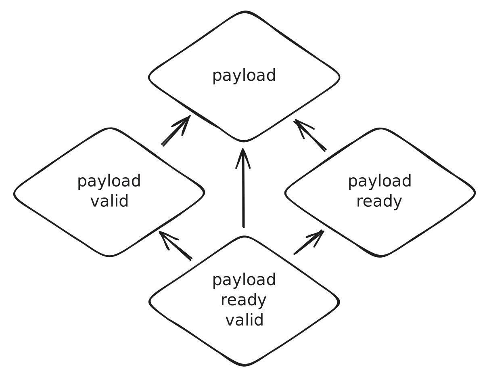

- Start Date: 2024-03-25
- RFC PR: [amaranth-lang/rfcs#61](https://github.com/amaranth-lang/rfcs/pull/61)
- Amaranth Issue: [amaranth-lang/amaranth#1244](https://github.com/amaranth-lang/amaranth/issues/1244)

# Minimal streams

## Summary
[summary]: #summary

Define a protocol for unidirectional communication (data streaming) with ready/valid handshaking.

## Motivation
[motivation]: #motivation

Digital designs are typically built from separately designed and tested functional blocks that are composed together and perform a high-level task by exchanging data. These blocks define interfaces that typically combine a payload (e.g.: bytes or symbols received or sent via a physical interface, addresses and data on a memory bus, samples exchanged between DSP blocks) with handshaking or flow control (e.g.: whether the physical interface can accept a new symbol or has one available, whether a memory transaction is in progress, whether the DSP block has finished processing).

Amaranth supports specifying the structure of such interfaces with the very general `amaranth.lib.wiring` module, but the structure is only half of the story, as even the simplest flow control schemes include complex requirements, restricting not only the permissible sequences of states of flow control signals, but often also the domain from which the signals may be driven, and which signals may combinatorially depend on which other ones. A mistake in flow control circuitry is often difficult to discover (it may only manifest when used with a subset of compatible blocks and not surface in tests) and debug (waveform viewers generally do not show data dependencies so it may not be clear why a certain signal is asserted or deasserted).

This complexity and challenges makes it useful to standardize on specific data exchange interfaces with a simple, robust, flexible, and well-defined flow control scheme. This proposal offers one such scheme suited for unidirectional communication only. In turn, it can be used to build bidirectional communication protocols.

## Guide-level explanation
[guide-level-explanation]: #guide-level-explanation

The `amaranth.lib.stream` module defines the concept of a *stream*. A stream is an `amaranth.lib.wiring` interface consisting of three port members:
- `payload: Out(payload_shape)`
- `valid: Out(1)`
- `ready: In(1)`

The purpose of a stream is to mediate unidirectional data transfer between two components, called a *transmitter component* (which drives `payload` and `valid` members in its *output stream*, and samples `ready`) and a *receiver component* (which drives `ready` member in its *input stream*, and samples `payload` and `valid`). The directions of port members above are from the perspective of the transmitter component, as required by `amaranth.lib.wiring`. The values of every member must be fixed or change according to the same clock domain.

Data is transferred via the stream according to the following rules:
1. On each cycle where both `valid` and `ready` are asserted, a transfer is performed: the contents of `payload` is conveyed from the transmitter to the receiver.
2. Once the transmitter asserts `valid`, it must not deassert it until a transfer is performed.
3. As an exception to rule (2), when the transmitter is reset it must deassert `valid`, unless it ties `valid` to `Const(1)` in the interface object.
4. Once the transmitter asserts `valid`, it must not change the contents of `payload` until a transfer is performed.
5. The transmitter must not wait for `ready` to be asserted before asserting `valid`. Any form of feedback from `ready` that causes `valid` to go from deasserted to asserted is prohibited.
6. Once the receiver asserts `ready` it may deassert it at any time.
7. The receiver may wait for `valid` to be asserted before asserting `ready`. Combinatorial feedback from `valid` to `ready` is allowed.

These rules ensure that transmitters and receivers can be developed independently yet safely used together, without unduly restricting the application-specific conditions that determine assertion of `valid` and `ready`.

Some transmitters and receivers may be designed in a way that requires them to perform a transfer on every cycle when they are not reset. Such transmitters and receivers may (but are not required to) tie `valid` to `Const(1)`. Similarly, some transmitters and receivers may be designed without support for backpressure. Such transmitters and receivers may (but are not required to) tie `ready` to `Const(1)`.

If these control signals are tied to `Const(1)`, then `amaranth.lib.wiring.connect` ensures that only compatible streams are connected. For example, if the transmitter does not support backpressure (`ready` tied to `Const(1)`), it can only be connected to receivers that do not support backpressure. However, receivers that do not support backpressure can be connected to any transmitter, since the receiver would appear as an always-ready one to a transmitter that does support backpressure. Similar logic applies to `valid` when it is tied to `Const(1)`.

## Reference-level explanation
[reference-level-explanation]: #reference-level-explanation

A new `amaranth.lib.stream` module is added, defining two classes: `Signature` and `Interface`:
- `amaranth.lib.stream.Signature(payload_shape, *, always_valid=False, always_ready=False)`
    - with members:
        - `payload: Out(payload_shape)`
        - `valid: Out(1)`
        - `ready: In(1)`
    - with properties:
        - `always_valid: bool`
        - `always_ready: bool`
    - with methods:
        - `__eq__(other)`: requires `isinstance(other, amaranth.lib.stream.Signature)` and all three of `payload_shape`, `always_valid`, `always_ready` to match
        - `create()`: constructs an `amaranth.lib.stream.Interface`
- `amaranth.lib.stream.Interface(signature, *, path=None, src_loc_at=0)`
    - with attributes:
        - `.payload = Signal(payload_shape)`
        - If `signature.always_valid == False`: `.valid = Signal()`
        - If `signature.always_valid == True`:  `.valid = Const(1)`
        - If `signature.always_ready == False`: `.ready = Signal()`
        - If `signature.always_ready == True`:  `.ready = Const(1)`
    - with properties:
        - `p`: alias of `payload`

Like other `amaranth.lib` modules, it is intended to be imported with the `from amaranth.lib import stream` statement and the classes be used with their qualified names, `stream.Signature` and `stream.Interface`.

There is purposefully no `amaranth.lib.stream.Signature.payload_shape` property. It is expected that a future RFC will enable construction and introspection of complex streams, and the provision of any introspection of the payload is deferred until then.

The `amaranth.lib.fifo.FIFOInterface` class is extended with properties:
- `r_stream: stream.Interface`: interface adapter with `payload = .r_data`, `valid = .r_rdy`, `ready = .r_en`.
- `w_stream: stream.Interface`: interface adapter with `payload = .w_data`, `valid = .w_en`, `ready = .r_rdy`.

## Drawbacks
[drawbacks]: #drawbacks

This proposal errs heavily on the side of minimalism, making it less broadly applicable.

This proposal locks in two major design decisions:
- That `payload` is a port member, not an interface member.
- That the stream signature always has exactly these three members.

If this turns out to be a mistake, existing code relying on the guarantees provided by these decisions will break.

## Rationale and alternatives
[rationale-and-alternatives]: #rationale-and-alternatives

### A: Scope of this proposal
[scope-of-this-proposal]: #scope-of-this-proposal

Streams are one of the most highly coveted planned features. While we could choose to not provide them at all (as an external library implementation is possible), this will make Amaranth less competitive and perpetuate the status quo of every complex downstream project implementing their own, incompatible, version of streams.

This module is described as "minimal" because it is highly limited in scope. This has the desirable qualities that it is easier to implement, document, and teach; that it is more widely compatible with existing code using streams; and that it is amenable to further gradual expansion.
- The payload is an opaque (to the `amaranth.lib.stream` module) shape that is not given further meaning.
- The rules of data transfer are very restrictive; in particular rules (5) and (7) ensure that the flow control is performed by the transmitter and the receiver independently.
- No interconnect components are proposed; only a minimal viable extension for the standard FIFOs, which is likely to be used in most designs.

The scope has been chosen to provide a useful implementation without delaying further work that relies on streams until every detail involved in defining fully functional streams can be agreed upon. Although it largely avoids delving into such detail, it does make some choices that will impact further work (see the [Drawbacks] section). We could decide to reject this proposal in favor of one with a broader scope and make a choice informed by further design and prototyping, but this is likely to unacceptably delay other work.

### B: Always-valid and always-ready streams
[always-valid-and-always-ready-streams]: #always-valid-and-always-ready-streams

Although, in general, a transmitter may produce a payload only on some cycles (communicated by `valid`) and a receiver may accept a payload only on some cycles (communicated by `ready`), there are important cases where dynamic flow control on either endpoint is undesirable, such as:
- A SerDes/transceiver block would typically produce a symbol and consume a symbol on each cycle, with no ability to pause transmission or reception without losing the link.
- Similarly, a parallel ADC will produce a code on each cycle, and a parallel DAC will accept a code on each cycle.
- When interfacing with such I/O devices, there is no need for flow control, and it should be excluded from the interconnect as it can cause significant overhead. This especially applies to the `ready` signal, which can form long combinatorial chains through the interconnect, pessimizing delay. The `valid` signal is registered, pessimizing area alone.
- Digital signal processing blocks often perform computations at a constant rate; for example, a pipelined multiplier may accept a pair of operands each cycle, and produce a result each cycle, with a fixed latency of 5. In such blocks, accounting for bubbles in the pipeline can be complex and error-prone, while stopping the entire pipeline if the inputs are not `valid` can cause deadlocks.

It appears essential to support endpoints that always assert `valid` and/or `ready`. There are several possible approaches to implementing them:

1. Do nothing special. Assign `valid` and/or `ready` to `1` at all times.
2. Remove `valid` and/or `ready` from the signature of such streams, and treat the four kinds of streams entirely separately.
3. Remove `valid` and/or `ready` from the signature of such streams, and use subclasses to unify the four kinds of streams.
4. Set the `valid` and/or `ready` attributes to `Const(1)` and rely on `amaranth.lib.wiring.connect()` to enforce well-formedness of connections.
    - This is the option used in this proposal.

Option (B1) is not very useful: streams have no way to indicate an error, so data being pushed into a non-ready stream from an always-valid one will get discarded, and an always-ready stream will pull nonsense data from a non-valid stream.

Option (B2) is not very useful either: since there is no way to treat the four kinds of streams generically, even basic interconnect (e.g. a FIFO queue) will in effect have 16 possible instantiations, which is too high of a burden to implement and test.

Option (B3) would, at first glance, require the use of a complex diamond inheritance pattern (below) and adaptation functions converting one type of interface into another. Unfortunately, even that cannot be made to work, since the subtyping relationship does not capture directionality. A payload+ready+valid output stream can be connected to a payload+valid (always ready) input stream, but not vice versa; similarly, a payload+ready output stream (always valid) can be connected to a payload+ready+valid input stream, but not vice versa.

Thus, option (B4) is the only feasible one: it does not require interface adaptation and avoids complex inheritance hierarchies in favor of a one-class solution while at the same time capturing the complex and directional subtyping relationship through the use of `amaranth.lib.wiring.connect()`. Also, since `connect()` can connect multiple streams, it is possible to broadcast a stream (connect a single transmitter to multiple receivers) with no interconnect, provided that none of the receivers require backpressure.

### C: Payload shape
[payload-shape]: #payload-shape

There are three options for the payload member that are naturally possible with `lib.wiring`:

1. Unrestricted `payload` member: a shape (port) or a signature (interface) are all valid, with no restrictions on the interface.
2. `payload` member restricted to a shape (port) or a signature (interface) with only `Out` members.
3. `payload` member restricted to a shape (port) only.
    - This is the option used in this proposal.

Option (C1) is not viable as it allows bidirectional communication to happen through the `payload` member, in contradiction to the goals of this proposal. Among other reasons, it makes streams no longer possible to pass through an async FIFO for clock domain crossing, which drastically reduces their usefulness.

Option (C2) does have the advantage of splitting the payload into individual signals, which are more visible in waveform diagrams and on module boundaries in Verilog. However, it has a serious drawback, which is that `amaranth.lib.wiring.connect()` will not connect a single member to multiple members. This means that streams can no longer be directly connected to the three signals made available by the existing FIFOs in `amaranth.lib.fifo`, requiring adaptation.

Option (C3) affords the same flexibility in the payload as option (2), without requiring stream-specific FIFOs; instead, an existing FIFO with its `[rw]_ack`, `[rw]_rdy`, `[rw]_data` signals can be connected to a stream endpoint provided that the same signals are put into an `amaranth.lib.wiring.PureInterface`, as long as the `[rw]_data` signal has the right width.

### D: Omitted features
[omitted-features]: #omitted-features

This proposal intentionally omits the following features:
1. packetization (often implemented using `first` and/or `last` control signals)
2. multiple lanes (often implemented using `data[n]` data signal coupled with `stb[n]` control signal)
3. sub-streams (often implemented using `id` and `dest` sideband signals)
4. unstructured metadata (often implemented using `user` sideband signal)

Based on the prior art examined and preliminary design work, the author of this proposal believes that all of these features may be implemented in a backward-compatible manner, by embedding all of the associated information in the `payload` port member and enabling extraction of the features and their configuration from the signature of the stream. This has the advantage that not all interconnect needs to be aware of such features, and interconnect that has little ability to be enhanced by them (e.g. an async FIFO) will be compatible with them without any changes.

There is no `payload_shape` accessor on `amaranth.lib.stream.Signature` to allow flexibility for future expansion.

## Prior art
[prior-art]: #prior-art

The two main influences on this proposal are AMBA AXI4-Stream protocol and LiteX stream functionality.

### AMBA AXI-Stream
[amba-axi-stream]: #amba-axi-stream

The AMBA AXI-Stream protocol is specified in the openly available [ARM IHI 0051B document](https://documentation-service.arm.com/static/64819f1516f0f201aa6b963c) and is similar in some respects to this proposal. **The protocol described in this proposal is not compliant with the AMBA Specification nor is it intended to be compliant with the AMBA Specification.** The AMBA specification is merely referenced here as a point of discussion.

The AMBA AXI-Stream protocol is both more specialized and more constrained than this proposal. To compare them:
1. AXI-Stream signal **TDATA** must be an integer number of bytes (a multiple of 8 wide) and is recommended to be a power of 2 and cannot be zero-width. This proposal makes no such restrictions.
2. AXI-Stream allows, though does not recommend, the omission of **TREADY** and **TVALID** signals. This proposal mandates their inclusion but allows tie-off to constant 1.
3. The rules for asserting **TREADY** and **TVALID** in AXI-Stream are the same as the rules for asserting `ready` and `valid` in this proposal, except for the deassertion of `valid` during reset.
4. AXI-Stream separates the optional ancillary signals **TSTRB**, **TKEEP**, **TLAST**, **TID**, **TDEST**, **TUSER** from the primary **TDATA** signal. This proposal includes all of these signals under the umbrella `payload` port. Note that the AXI-Stream handshake covers both **TDATA** and all of the ancillary signals that are present (see figures 2-1, 2-2, 2.3); as such, it is similar to this proposal in that their treatment is similarly uniform.
5. AXI-Stream includes complex rules for merging, packing, upsizing, downsizing, interleaving, and ordering, as well as position bytes and null bytes, which are not present in this proposal and are not in its scope.
6. AXI-Stream mandates that transfers happen synchronously to the rising edge of **ACLK**, and specifies **ARESETn** to be an active low reset (synchronous or asynchronous). This proposal differs in that it allows any clock and reset expressible as an Amaranth clock domain. It is similar in that it mandates `valid` to be driven low during reset, but has a carve-out for tying `valid` to 1.
7. AXI5-Stream includes a **TWAKEUP** signal for power management. This signal is associated with a stream but is not subject to handshaking; it is not directly a part of the stream, even if it influences the behavior of the stream and can cause a deadlock.

Although the protocol in this proposal and the AXI-Stream protocols are not interoperable, it is possible and straightforward to define components that are functionally compliant (without exceptions) with both the protocol in this proposal, making use of a subset of it, and the AMBA AXI4-Stream or AXI5-Stream protocols. Such components will require an adapter to match the AXI-Stream protocols, but the adapter will not require any logic gates.

The AXI4-Stream protocol is pervasively used in the industry and well regarded, and the ability to define components functionally compatibile with it is highly desirable. At the same time, some of the technical features of the AXI-Stream protocols (most importantly the restrictions on the **TDATA** signal, which prevent the use of arbitrary data/payload shapes), as well as the license under which it is distributed, make it unsuitable for use as-is in the Amaranth ecosystem.

### Avalon-ST

The Avalon-ST protocol is specified in the openly available [Intel 683091(2022.09.26) document](https://cdrdv2-public.intel.com/743655/mnl_avalon_spec-683091-743655.pdf) (section 5) and is similar in some respects to this proposal. The Avalon-ST specification is merely referenced here as a point of discussion.

The Avalon-ST protocol is similar to this proposal, but includes some additional features. Note that "practically" below means "formally the wording may be different but it is not expected that this will ever cause any incompatibility in practical use". To compare them:
1. Avalon-ST signal `data` can carry 1 to 8192 bits, not restricted to a power of 2 or a multiple of 8, and can be omitted. Avalon-ST includes a provision for bytes, but the byte size can be any number from 1 to 512 bits. This is practically identical to this proposal.
2. Avalon-ST does not require inclusion of any of the signals, even `ready` and `valid`. This proposal mandates their inclusion but allows tie-off to constant 1.
3. The rules for asserting `ready` and `valid` in Avalon-ST when the components are configured with `readyLatency = readyAllowance = 0` are practically the same as rules for asserting `ready` and `valid` in this proposal. Some of the behavior in Avalon-ST is implicitly specified; the `valid` signal is required to be registered at the source, which defines its behavior during reset (that matches this proposal). However, the `readyLatency > 0` or `readyAllowance > 0` configuration has no equivalent to this proposal (or the other stream interfaces being compared).
4. Avalon-ST separates the optional ancillary signals `channel`, `error`, `empty`, `startofpacket`, `endofpacket` from the primary `data` signal. This proposal includes all of these signals under the umbrella `payload` port. Note that the Avalon-ST handshake covers both `data` and all of the ancillary signals that are present per the description of the `valid` signal in Table 17; as such, it is similar to this proposal in that their treatment is similarly uniform.
5. Avalon-ST optionally includes fairly simple routing and packetization interfaces, which are not present in this proposal and are not in its scope.
6. Avalon-ST mandates that transfers happen synchronously to the rising edge of the associated clock sink, and that the logic is reset by the associated reset sink. This proposal differs in that it allows any clock and reset expressible as an Amaranth clock domain. Avalon reset sinks are as expressive as Amaranth clock domain resets. In both this proposal and Avalon-ST, `valid` will be either tied off to 1 (in which case it's omitted from Avalon-ST) or driven low during reset.
7. Avalon-ST includes an unusual `error` signal that allows the source signal an error to the sink. Importantly, it is not useful for signaling protocol errors (e.g. overflow due to an error in `ready` signal handling by the source), since the sink either drives only a `ready` signal or nothing.

The protocol in this proposal and the Avalon-ST protocol are interoperable if the Avalon-ST interface is configured with parameters `readyLatency = readyAllowance = 0` and includes `data`, `ready`, and `valid` signals only (i.e. beats, packets, or channels are not used). In addition, `data` must be renamed to `payload` and a posedge clock domain must be used in Amaranth.

The Avalon-ST protocol is widely used in the industry, especially in the Altera (Intel (Altera)) ecosystem, and the ability to define components interoperable with it is highly desirable. While it could be used as-is in the Amaranth ecosystem, it is valuable to reconsider whether the inclusion of some of the rarely used features is worth the support and compatibility burden, since all generic interconnect would have to be aware of them. Splitting of `data` into symbols or bytes seems particularly unnecessary.

The `readyLatency` and `readyAllowance` parameters allow a more efficient use of FPGA resources (registers) and while adding them at this stage seems premature, it is a useful feature and should be considered for future work. Since connecting interfaces with mismatched `readyLatency` and `readyAllowance` is disastrous (results in silent data loss), this would likely require support for matching interface parameters to `amaranth.lib.wiring.connect()`, which is not currently available. Such support must be able to take into account that interfaces are compatible if a parameter of the source is *equal or less than* of the same parameter on the sink, which is a complex relation that would require significant design work.

### LiteX streams
[litex-streams]: #litex-streams

The LiteX stream protocol does not have a specification. It is described in a [very short wiki page](https://github.com/enjoy-digital/litex/wiki/Streams) as "LiteX's streams are a simplified compromise between AXI-4/Avalon-ST" and is similar in some respects to this proposal. There is also [an implementation](https://github.com/enjoy-digital/litex/blob/master/litex/soc/interconnect/stream.py) that may be used to attempt to understand the protocol.

The LiteX stream protocol is very similar to this proposal, but includes some additional features. To compare them:
1. LiteX stream `payload` signal can carry unrestricted structured data, similarly to the `payload` port in this proposal. However, since it is a full Migen `Record`, it carries the same flaw as the [option (C1)][payload-shape], and it is easy to misuse it.
2. LiteX streams always include all of the defined signals: `valid`, `ready`, `first`, `last`, `payload`, and `param`, handling always-valid/always-ready streams the same way as [option (B1)][always-valid-and-always-ready-streams], and always including [options (D1) and (D4)][omitted-features]. This proposal includes only `valid`, `ready`, and `payload`.
3. The rules for assertion of `ready` and `valid` are not documented but (given the references to AXI-Stream and Avalon-ST) may be assumed to be entirely or mostly compatible with these two protocols, and consequently this proposal.
4. LiteX streams separates ancillary signals `first`, `last`, and `param` from the primary `payload` signal. This proposal includes all of these signals under the umbrella `payload` signal, if they are implemented. The flow control rules for `first` and `last` are the same as for the `payload` signal in LiteX, but the flow control rules for `param` are different: `param` must be constant for the entire duration of a packet. (The flow control rules for `param` reference the flow control users for `TUSER` in AXI-Stream, but this is actually incorrect: unlike `param` in LiteX, `TUSER` in AXI-Stream specifies ancillary data per-byte or per-transfer, not per-packet).
5. LiteX would appear, from the examination of the signals, to include a mandatory packetization scheme, but this is not the case. Rather, any sources, sinks, or interconnect that do not support packetization ignore `first` and `last`, and those of them which do support packetization may support exclusively `first` or exclusively `last`. There is no way to indicate any of these choices mechanically.
6. LiteX streams and this proposal both reference transfers to a clock domain. However, Migen only supports posedge clocks and synchronous active-high reset.

The protocol in this proposal and the LiteX stream protocol cannot be readily described as interoperable or not due to the lack of formal description and general scarcity of documentation of the LiteX stream protocol. However, so long as packetization is not involved, and the LiteX `param` record is empty, they are probably interoperable.

The LiteX stream protocol is used exclusively in the LiteX ecosystem. Due to the rich availability of ready-made components in this ecosystem, the ability to define components interoperable with it is desirable. However, this is challenged by the difficulty of determining the feature set supported by a particular LiteX component. The flow control rules for the LiteX `param` signal are also unusual and may require an adapter with logic gates to reliably ensure compliance of an arbitrary Amaranth stream with the LiteX rules.

Due to the fact that LiteX endpoints and interconnect [often arbitrarily decide to implement or leave unimplemented any subset of the `first` and `last` signals without necessarily documenting this choice](https://github.com/amaranth-lang/amaranth/issues/317#issuecomment-899407394), it is easy to run into data loss, deadlocks, and other confusing behavior with LiteX streams, especially as a newcomer to the ecosystem. The author of this RFC has had LiteX streams described to her as "frustrating", "a real source of difficulty", or in one case "traumatizing". This was the driving force behind the decision to **not** include either `first` or `last` signals in this proposal. It was also one of the chief motivations behind `amaranth.lib.wiring` refusing to connect interfaces except in a highly restrictive manner where signals may not be arbitrarily excluded at the point of connection.

## Unresolved questions
[unresolved-questions]: #unresolved-questions

None.

## Future possibilities
[future-possibilities]: #future-possibilities

- A new module with FIFO queues can be added (e.g. `amaranth.lib.queue`) with largely the same functionality that are built as components and are stream-only.
    - This has the advantage of being less constraining. Since all of the functionality of the existing `amaranth.lib.fifo` module as of Amaranth 0.5 will be provided in it, a clean migration path is available.
- Streams can be extended with a mechanism to specify complex payload shape that can be introspected by interconnect.
- Interconnect components that operate on and process such complex payloads can be added via the RFC process, such as:
    - Lane converters (up-converter, down-converter).
        - [RFC 56](0056-mem-wide.md) almost but not quite enables existing FIFO queues to serve as such.
    - Packetizers/de-packetizers.
    - Packet based queues that allow accepting or discarding a complete packet, or discarding incomplete or corrupted packets.
    - Stream routers based on destination ID.
    - Stream aligners that ensure a packet always starts on the 0th lane, or each Nth lane (e.g. each 4th 8-bit lane, for 32-bit alignment).
- AXI3 or AXI4 interfaces may be added to Amaranth SoC, as these protocols are designed as a bundle of streams (address channels, data channels, and completion channel).
- The `readyLatency` and `readyAllowance` configuration parameters of Avalon-ST may be further investigated and potentially added to streams if they turn out to be broadly useful.
- The `amaranth.lib.io` library may be extended to add a pair of always-ready, always-valid stream interfaces to `FFBuffer` and `DDRBuffer` (one for input, one for output). In this way, the same paradigm, multi-lane bit streams, may be used to communicate at data rates anywhere from 1 kilobit/s to 1 terabit/s.

### Stream combinators
[stream-combinators]: #stream-combinators

This proposal references many desirable stream features (primarily multiple lanes and packetization) to a future RFC that will extend the existing design. In the interest of convincing the reader that such an RFC is feasible, a sketch of how such extension may look like follows.

The stream protocol is extended with "combinators", a composable mechanism of defining the shape and behavior of the `payload` members. The `payload` argument of the `amaranth.lib.stream.Signature(...)` constructor may receive a *combinator*, which is a shape-castable object (usually a `data.Struct` subclass):
1. `payload=Lanes(4, lane_shape)`
    - causes the `payload` member to contain a `lane: ArrayLayout(lane_shape, 4)` field
    - an up/down-converter interconnect may, by introspection, determine whether the input and output streams are compatible and what the ratio of lanes is
2. `payload=Lanes(4, lane_shape, en=True)`
    - causes the `payload` member to contain a `lane: ArrayLayout(lane_shape, 4)` field and a `en: 4` field
    - by introspection, the endpoints and the interconnect is aware that some of the lanes may not contain meaningful data and discard such data during up/down-conversion or upon receipt
3. `payload=Packet(data_layout, first=True, last=True)`
    - causes the `payload` member to contain a `data: data_layout` field, as well as `first: 1` and `last: 1` fields
    - by introspection, the components are aware that each individual transfer may begin and/or end the packet, with packet data being uninterpreted
4. `payload=Packet(Lanes(4, lane_shape), first=True, last=True)`
    - causes the `payload` member to contain a `data: StructLayout({"lane": ArrayLayout(lane_shape, 4)})` field, as well as `first: 1` and `last: 1` fields
    - by introspection, the components are aware that each individual transfer may begin and/or end the packet, and that each packet consists of four individual symbols
5. `payload=Lanes(4, Packet(data_shape, first=True, last=True))`
    - causes the `payload` member to contain a `lane: ArrayLayout(StructLayout({"data": data_shape, "first": 1, "last": 1}), 4)` field
    - by introspection, the components are aware that each individual transfer consists of up to four individual packets, and that packets may begin or end at any symbol

Please note that the degree of configurability in the examples is illustrative of the potential of the proposed functionality and do not necessarily reflect best practices to be established. That said, example (4) follows a real-world example where a 1024-bit wide bus used in a high-throughput PCIe interconnect implementation requires support for multiple packets per transfer to meet its efficiency target.

Stream combinators can be defined in code downstream to Amaranth, and streams employing user-defined combinators remain usable with some standard interconnect; e.g. an async FIFO does not introspect the payload at all, and an up/down-converter only "unwraps" the outermost combinator, expecting to find the `amaranth.lib.stream.Lanes` combinator there, and treating the `lane_shape` shaped element as opaque.

The fact that `amaranth.lib.wiring.connect()` will connect any two port members with a matching name and width and compatible flows without regard to the shape of the member is concerning in light of the importance of the shape of the `payload` member of a stream. There are multiple options in handling this issue, including:
1. Reconsidering the behavior of `amaranth.lib.wiring.connect()` so that the shape of a port member is taken into account, either to emit a warning or to raise an error.
2. Introducing additional behavior to `amaranth.lib.wiring.connect()` so that a function attached to a port member is called to check its compatibility with another port member.
3. Relying on the fact that adding a stream combinator essentially always changes the width of the `payload` member and therefore the existing width check is sufficient to catch most errors.
